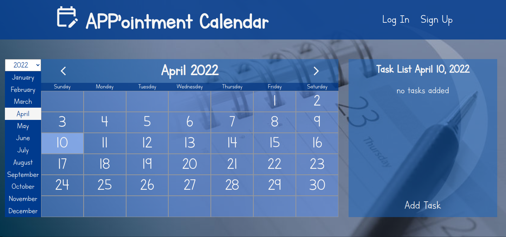
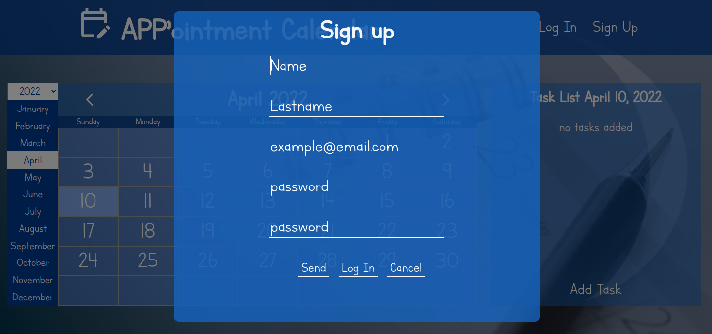
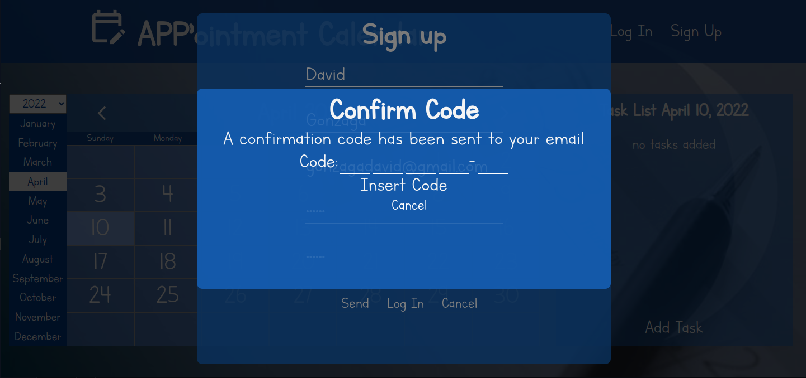
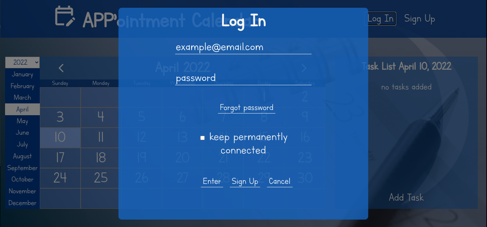
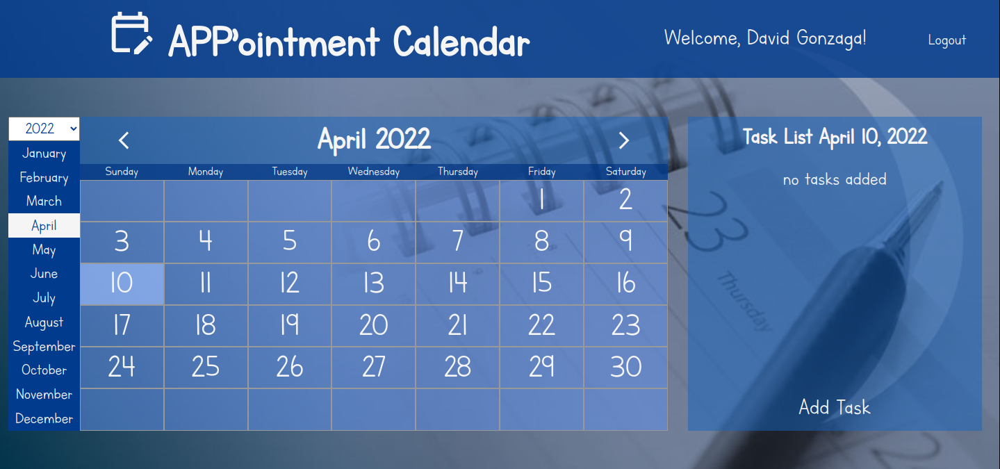
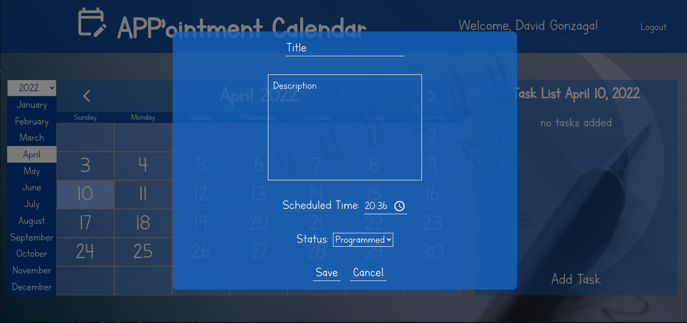
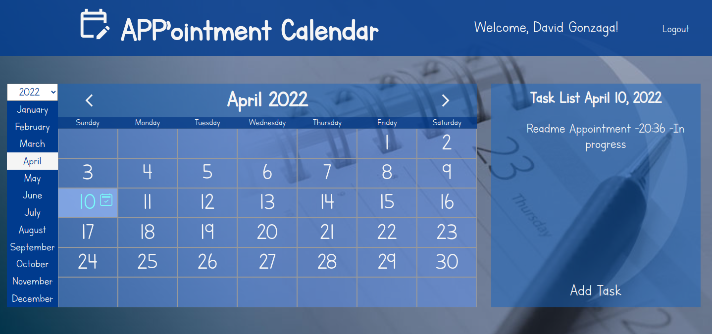
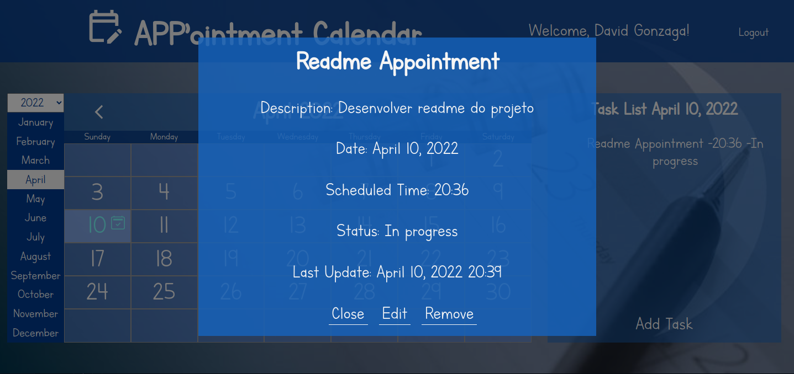

# App'ointment Calendar - Frontend

<h1><a href="https://appointment-calendar-frontend.vercel.app/" >Visite a Aplicação</a></h1>

---

<h2><a href="https://github.com/Gonzagadavid/appointment-calendar-backend" >App'ointment Calendar - Backend</a></h2>

---

# Sumário

- [Detalhes da aplicação](#detalhes-da-aplicação)
  - [Tela inicial](#tela-inicial)
  - [Cadastro](#cadastro)
  - [Login](#login)
  - [Adicionar tarefa](#adicionar-tarefa)
- [API](#api)
- [Tecnologias](#tecnologias)
- [Deploy](#deploy)
- [Futuras Implementações](#futuras-implementações)

---

# Detalhes da aplicação

## Tela inicial

Ao iniciar a aplicação, a pessoa usuária terá acesso normalmente ao calendário, porém para adicionar tarefa será requisitado o login. 

## Cadastro

Ao clicar em Sign Up na parte superior direita a pessoa usuária porderá se cadastrar na aplicação, forncendo nome, sobrenome e um email ativo.

Após a pessoa fornecer as informações, um código de quatro caracteres e um digito será enviado no email, então será renderizado um modal para que a pessoa possa inserir e assim validar seu email.

## Login

Ao clicar em Log In na parte superior da tela a pessoa usuária poderá entrar na aplicação, tendo a opção de manter-se logada. 
Caso a pessoa esqueça a senha basta clicar em 'Forgot password' e a senha será enviada para seu o email.

Após logar o nome da pessoa usuária será exibido no lado superio direito da tela

## Adicionar tarefa

Para adicionar tarefa basta a pessoa usuária clicar em 'Add Task' na parte inferior direita

Após preencher o formulário com as informações da tarefa e clicar em 'Send', será exibido os detalhes da tarefa, e então a tarefa será adicionada na lista daquele dia.
Os dias em que tarefas são adicionado a cor da data será azulada com um ícone, indicando que há compromisso para aquele dia.

## Detalhes da tarefa

Ao clicar em uma tarefa da lista, será exibido os detalhes da tarefa, e pessoa poderá também editar e remover a tarefa.

---

# Api

Para a renderização correta do calendário foi utilizada a API [Calendar JSON API](#https://github.com/Gonzagadavid/calendar-json-api)

---

# Tecnologias

- React
- Typescript
- Testing Library
- Axios
- Eslint

   
  &nbsp;&nbsp;&nbsp;
  
  &nbsp;&nbsp;&nbsp;
  
  &nbsp;&nbsp;&nbsp;
  

# Deploy

Para o deploy da aplicação foi escolhido a [Vercel](#https://vercel.com/)

<h1><a href="https://appointment-calendar-frontend.vercel.app/" >Visite a Aplicação</a></h1>

# Futuras implementações

- cobertura de teste em 100% da aplicação

- implementar página para a pessoa adminitradora direcionar tarefas para outras pessoas usuárias
